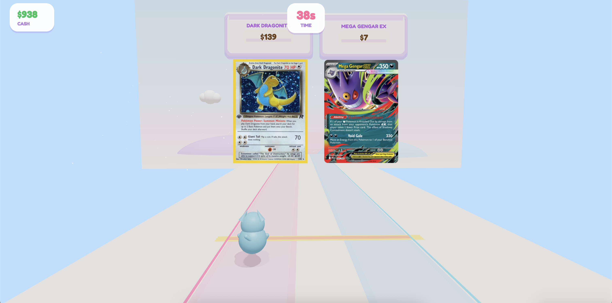
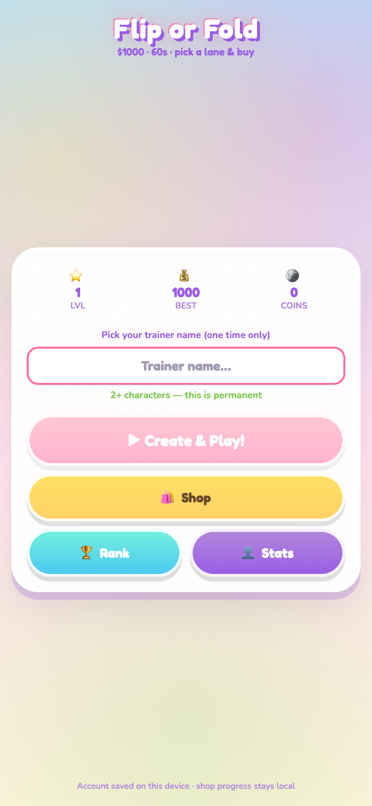
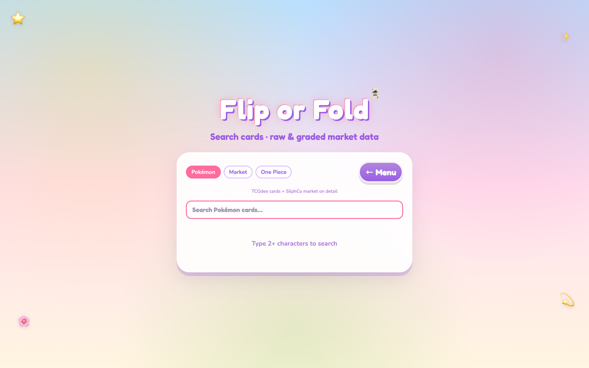

# Flip or Fold

**Renaiss Tech Hackathon S1 — Game category**

A fast-paced **lane-trading runner** built **on Renaiss Protocol** — real graded slabs from the **official Renaiss OS Index API** meet SilphCo market data (Pokémon + One Piece) in a 60-second deal-or-pass game. Optional **BSC wallet checkout** for premium bonuses.

> *Flip real collector cards. Train on Renaiss-indexed prices. Browse graded slabs without leaving the game.*

**▶ Play now:** [https://flip-or-fold.vercel.app](https://flip-or-fold.vercel.app/)

> **Renaiss in 30 seconds (judges):** Menu → **Both** → play. Graded slabs use **real prices from `api.renaissos.com`**. Profit = Renaiss Index value − shop offer. Card Dex hits the same API live. Classic 554-card pool = SilphCo raw singles. Only the **shop tag** is randomized for gameplay.

---

## Screenshot



| Menu & trainer setup | Card Dex (Pokémon + market + One Piece) |
|---|---|
|  |  |

---

## Live demo (judges)

**No setup required** — open **[flip-or-fold.vercel.app](https://flip-or-fold.vercel.app/)** in Chrome, Firefox, or Safari. No account or wallet needed for the core game.

### Local run (optional)

```bash
npm install
cp .env.example .env   # only if you want your own Supabase / API keys
npm run dev
```

Open **http://localhost:5173**

**Suggested judge path (≈3 min):**

1. Menu → set card pool to **Both** (classic + **Renaiss graded slabs**).
2. **Create & Play** — run one 60s round (←/→ or A/D). Profit/loss uses **real Renaiss `marketPrice`** on graded cards (e.g. PSA 10 slabs worth $1k–$128k).
3. **Card Dex** → **One Piece** → search `Luffy` → SilphCo market + **Search Renaiss graded** (live call to `api.renaissos.com`).
4. **Pokémon** tab → `Charizard` → SilphCo + Renaiss graded layer.
5. **Rank** after game over.

**Card pool toggle (menu):**

| Mode | Cards | Where prices come from |
|------|-------|------------------------|
| **Classic** | 554 bundled (Pokémon + One Piece) | SilphCo TV-WAP / median |
| **Renaiss** | Graded slabs from Renaiss Index | **Official Renaiss OS Index API** → Supabase cache |
| **Both** | Classic + Renaiss | Mix of SilphCo raw + **real Renaiss graded prices** |

---

## Hackathon fit

| Criterion | How Flip or Fold addresses it |
|-----------|-------------------------------|
| **Usability** | Playable in-browser in under 10 seconds; keyboard + touch-friendly lanes; kawaii HUD explains profit/loss on every trade. |
| **Innovation** | Arcade runner meets *real* market data — shop prices are randomized vs cached/API market values; Card Dex layers Renaiss grading on SilphCo (Pokémon + One Piece) and TCGdex. |
| **Ecosystem relevance** | **First-class Renaiss integration:** official **OS Index API** (`api.renaissos.com`) powers the playable graded pool, Card Dex live search, and deep links to [index.renaissos.com](https://index.renaissos.com). BSC testnet checkout on Renaiss’s chain. |
| **Clarity** | Three price layers are labeled: Renaiss graded (real Index data), SilphCo/TCGdex (raw market), shop display (randomized skew for gameplay). |
| **Safety** | No email/password; wallet optional; crypto verified on-chain server-side; API keys client-side are rate-limited public tiers only. |

**Category:** Game — a playable on-ramp to the Renaiss collector economy, not a mockup.

---

## Renaiss Protocol integration (official API)

Flip or Fold is built around the **Renaiss OS Index API** — the same data collectors see on [index.renaissos.com](https://index.renaissos.com).

### How we call Renaiss

| Touchpoint | API | What happens |
|------------|-----|--------------|
| **Graded card pool (in-game)** | `GET api.renaissos.com` via `sync-renaiss-cards.mjs` | ~73+ PSA-graded slabs (Pokémon + One Piece) synced into Supabase `trading_cards` — **name, image, grade, `marketPrice` in USD** come straight from Renaiss |
| **Gameplay (Renaiss / Both mode)** | Supabase `get_trading_card_pool()` | Cards enter the 60s runner; **`profit = Renaiss marketPrice − shopPrice`** — players flip real indexed values ($1k–$128k slabs) |
| **Card Dex — live search** | `api.renaissos.com` from the browser (`renaissBrowser.ts`) | Button-triggered search & card detail; rate-limit aware; links back to Renaiss Index |
| **Card Dex — cached search** | Supabase RPC `search_trading_cards` | Instant graded lookup without burning API quota |

**Endpoints & auth:** `https://api.renaissos.com` with official partner keys (`VITE_RENAISS_API_KEY` / `VITE_RENAISS_API_SECRET`). No scraping, no third-party resale of Renaiss data.

### What is real Renaiss data vs other sources

| Data | Source | Used where |
|------|--------|------------|
| **Graded slab price, grade, image, set** | **Renaiss OS Index API** | Renaiss/Both pool, Card Dex graded panel, profit calculation on Renaiss cards |
| Raw Pokémon / One Piece singles | SilphCo Analytics API | Classic pool (554 cards), Card Dex market tabs |
| Pokémon card metadata | TCGdex SDK | Card Dex Pokémon tab |
| Shop display price | Game logic (random skew) | Lane labels only — **does not replace** Renaiss `marketPrice` on graded cards |

**Key point for judges:** When you see a **PSA 10 Luffy** in-game with a **$128k worth** label, that value is **Renaiss Index data**, not a made-up number. The shop may offer it above or below that — your job is to spot the deal.

---

## What we built

### Core game — Flip or Fold

- **60-second runs** — start with **$1,000** play cash; game ends at $0 or timeout.
- **Two-lane deals** — two distinct cards approach; move left/right to buy the card in that lane.
- **Profit model** — `profit = marketValue − shopPrice`. On **Renaiss cards**, `marketValue` is the **real price from Renaiss Index**. Shop price is randomized (deal / rip / fair) so players practice collector instincts.
- **Powerups** — slow-mo, appraisal (reveal true value), insurance, 2× profit, cash bonus (tap to collect).
- **Meta progression** — coins & XP after each run → shop (buddies, trails, upgrades, emotes).
- **554-card classic pool** — **475 Pokémon** + **79 One Piece** singles playable in-game; optional **Renaiss graded pool** (PSA slabs, Pokémon + One Piece) from Supabase cache.

### One Piece TCG (SilphCo + Renaiss)

SilphCo Analytics now exposes One Piece via `?game=onepiece` ([API guide](https://silphcoanalytics.xyz)). We integrated it in three places:

| Layer | What we did |
|-------|-------------|
| **In-game classic pool** | `npm run expand-onepiece-pool` pulls high-volume **singles** (Luffy, Zoro, Shanks, Law, Hancock, etc.) from SilphCo — filters out sealed products (booster boxes/cases). Prices from TV-WAP/median; art downloaded locally from TCGPlayer CDN (`pool/op-*.jpg`) for WebGL. |
| **Card Dex → One Piece tab** | Live search via `GET /api/v3/search?q=…&game=onepiece`. Card detail shows eBay/TV-WAP sales, grade breakdowns, volume. Renaiss graded cache + on-demand live search on each card. |
| **Renaiss graded pool** | One Piece slabs (e.g. PSA 10 Luffy) sync from Renaiss OS Index API into `trading_cards` — same high-value cards as on [index.renaissos.com](https://index.renaissos.com). |

**One Piece card IDs** use SilphCo format `op-{SET}-{NUMBER}` (e.g. `op-OP01-064`, `op-ST30-001`). Sealed SKUs like `op-498735` are excluded from the play pool.

### Card Dex (collector tool)

Three tabs, all search-on-demand (nothing bulk-stored in our DB except Renaiss cache):

| Tab | Search source | On card detail |
|-----|---------------|----------------|
| **Pokémon** | [TCGdex](https://tcgdex.dev) SDK | SilphCo market (TV-WAP, PSA grades) + button to search Renaiss graded |
| **Market** | [SilphCo Analytics](https://silphcoanalytics.xyz) API v3 | Full sales analytics + Renaiss graded search |
| **One Piece** | [SilphCo](https://silphcoanalytics.xyz) `?game=onepiece` + Renaiss cache | eBay/TV-WAP, sales volume, grades + Renaiss graded search on detail |

### Web3 shop (optional)

- Link MetaMask via **signed message** (proves wallet ownership).
- Buy premium packs with **tBNB on BSC testnet** (configurable to mainnet).
- Server **re-reads the transaction from BSC RPC** — client cannot fake payment.

### Backend

- **Supabase** — pseudo accounts (trainer name + device id), saves, leaderboard, crypto orders.
- **Edge functions** — `web3-link-wallet`, `web3-confirm-purchase` (service role only for finalize).

---

## Data sources & API usage

| Source | Used for | Stored in our DB? | Notes |
|--------|----------|-------------------|-------|
| **Renaiss OS Index API** (`api.renaissos.com`) | **Graded pool in-game**, Card Dex live search & detail, Index deep links | **Yes** — `trading_cards` cache (prices, grades, images, hrefs) | Sync via `npm run sync-renaiss-cards`; live browser calls on button press |
| **SilphCo Analytics API v3** | Card Dex (Pokémon + **One Piece**), classic pool expansion | **No** — client calls + build-time scripts | Pokémon: default. One Piece: `?game=onepiece`. Requires `VITE_SILPHCO_API_KEY`. |
| **TCGdex SDK** | Card Dex Pokémon search & card metadata | **No** — client-side cache (1h TTL) | Open Pokémon TCG dataset. |
| **Pokémon TCG API** / `images.pokemontcg.io` | Pokémon art (`materialize-pool-images.mjs`) | **No** — ~475 PNGs in `pool/` | WebGL-safe local bundles. |
| **TCGPlayer CDN** | One Piece card art (`expand-onepiece-pool.mjs`) | **No** — ~79 JPGs in `pool/op-*.jpg` | Downloaded at build time; avoids browser CORS in Three.js. |
| **Supabase** | Accounts, scores, saves, crypto orders | **Yes** — player-owned game state only | See privacy section. |

**Honest limitations (judges appreciate transparency):**

- **Classic pool (554 cards)** uses **SilphCo** prices, not Renaiss — switch to **Renaiss** or **Both** to play with Index-graded slabs.
- **Shop display price** is randomized for gameplay; **Renaiss `marketPrice` on graded cards is not faked**.
- Card Dex SilphCo/TCGdex figures may lag; Renaiss panel shows Index-sourced graded data only.
- Renaiss live search is button-triggered (~10 free API calls/day without partner keys).
- Not financial advice — hackathon demo.

---

## Privacy & user data

| Data | Collected? | Purpose |
|------|------------|---------|
| Email / password | **No** | — |
| Trainer name | **Yes** (user-chosen) | Pseudo account + leaderboard display |
| Device ID | **Yes** (`localStorage` UUID) | Same browser = same account; sent to Supabase RPCs |
| Game saves, coins, XP, shop | **Yes** | `player_saves` in Supabase |
| Wallet address | **Only if user links** | Crypto shop; verified by signature |
| IP / analytics | **Not implemented** | No third-party tracker in this repo |

- Leaderboard stores **final balance & run stats** — no replays or card-level PII.
- **No private Renaiss user data** is ingested; we only call public/index API endpoints with our keys.
- **Secrets** (`SUPABASE_SERVICE_ROLE_KEY`, API secrets) belong in server/Edge env only — never in the client bundle.
- Users can **unlink wallet** without deleting their trainer profile.

---

## Web3 safety (can users fake a payment?)

**No** — bonuses are granted only after server-side verification:

1. `crypto_prepare_order` creates a pending order (exact wei, treasury, 15‑min expiry).
2. User sends BNB from their **linked** wallet.
3. Edge function `web3-confirm-purchase` fetches `tx` + `receipt` from **BSC RPC** and checks:
   - transaction succeeded (`status === 1`)
   - `from` = linked wallet
   - `to` = treasury
   - `value` = order amount
   - `tx_hash` not reused
4. `finalize_crypto_order` (service role only) applies the bonus to `player_saves`.

Sending BNB to the treasury **without** a matching order does not unlock bonuses.

---

## Tech stack

- **Frontend:** React 19, Vite, TypeScript, Tailwind v4, Zustand, TanStack Query
- **3D:** React Three Fiber, Three.js, drei
- **Backend:** Supabase (Postgres + RPC + Edge Functions)
- **Web3:** ethers v6, Web3Modal, BSC testnet/mainnet (env switch)

---

## Environment variables

Copy `.env.example` → `.env`:

| Variable | Required | Purpose |
|----------|----------|---------|
| `VITE_SUPABASE_URL` | **Yes** (online features) | Leaderboard, saves, crypto |
| `VITE_SUPABASE_ANON_KEY` | **Yes** | Public Supabase client |
| `VITE_WALLETCONNECT_PROJECT_ID` | For wallet UI | WalletConnect |
| `VITE_BSC_NETWORK` | For crypto | `testnet` (default) or `mainnet` |
| `VITE_CRYPTO_TREASURY_ADDRESS` | For crypto | Receives payments |
| `VITE_SILPHCO_API_KEY` | Card Dex + pool scripts | SilphCo Pokémon **and** One Piece (`?game=onepiece`) |
| `VITE_RENAISS_API_KEY` / `SECRET` | Optional | Higher Renaiss quota in browser |

**Edge function secrets** (Supabase dashboard): `BSC_NETWORK`, `BSC_TESTNET_RPC`, `BSC_MAINNET_RPC`, `SUPABASE_SERVICE_ROLE_KEY`.

---

## Database setup

Apply Supabase migrations in order (`supabase/migrations/`):

- `003_players.sql` — trainer accounts & scores  
- `009_player_saves.sql` — progression & shop state  
- `012_web3_crypto_shop.sql` — wallet link & crypto catalog  
- `018_trading_cards.sql` — Renaiss card cache for game pool  
- `021_trim_cards_and_search_rpc.sql` — Card Dex search RPC  
- `022_search_cards_by_game.sql` — game filter for One Piece  

Then seed Renaiss cards (optional):

```bash
npm run sync-renaiss-cards   # fetch from Renaiss API → scripts/data/renaiss-cards.json
npm run seed-renaiss-cards   # upsert into Supabase
```

---

## Card pool scripts

```bash
# Pokémon classic pool
npm run fetch-cards              # legacy: curated ~76 cards from Pokémon TCG API
npm run expand-silphco-pool      # add Pokémon cards via SilphCo SQL (prices)
npm run materialize-pool-images  # download Pokémon art → pool/*.png (WebGL-safe)

# One Piece classic pool
npm run expand-onepiece-pool     # add OP singles via SilphCo ?game=onepiece + download pool/op-*.jpg
npm run expand-onepiece-pool -- --target 120   # optional: more cards

# Prices & Renaiss
npm run enrich-prices            # backfill TCGPlayer prices in cards.json
npm run sync-renaiss-cards       # Renaiss API → scripts/data/renaiss-cards.json
npm run seed-renaiss-cards       # upsert graded slabs into Supabase
```

**Classic pool manifest:** `src/assets/cards/cards.json`

| Pool | Count | Price source |
|------|-------|----------------|
| Pokémon (classic) | 475 | SilphCo |
| One Piece (classic) | 79 | SilphCo `?game=onepiece` |
| **Renaiss graded** | ~73+ | **Renaiss OS Index API** |
| **Total classic** | **554** | |

---

## Project structure

```
src/
  components/     Menu, HUD, Shop, Card Dex, Crypto panel, Leaderboard
  game/           R3F scene (cards, player, environment)
  systems/        Trading, waves, powerups, card loader, sound
  services/       TCGdex, SilphCo (pokemon + onepiece), Renaiss browser
  store/          Zustand (game, shop, auth, wallet UI)
  supabase/       Client, RPC wrappers, crypto wallet flow
  assets/cards/   cards.json + pool/*.{png,jpg}
supabase/
  migrations/     Schema & RPCs
  functions/      web3-link-wallet, web3-confirm-purchase
scripts/          Renaiss sync, SilphCo pool expand, image materialize
docs/images/    README screenshots
```

---

## Scripts for judges

```bash
npm run dev              # local play
npm run build            # production build
npm run record-journey   # Playwright video of full user journey (optional)
node scripts/user-journey-screenshots.mjs   # capture screenshot set
```

---

## Author

**degenanddev** ([@degenanddev](https://github.com/degenanddev))

- **Project:** [github.com/degenanddev/flipOrFold](https://github.com/degenanddev/flipOrFold)
- **Live demo:** [flip-or-fold.vercel.app](https://flip-or-fold.vercel.app/)
- **Hackathon:** Renaiss Tech Hackathon S1 — Game category

---

## Links

- **Hackathon:** [Renaiss Tech Hackathon S1 — AI, Game & Tool Sprint](https://medium.com/@renaissxyz/renaiss-tech-hackathon-s1-is-open-build-ai-games-tools-for-the-collector-economy-0ab1b39c23c4) (Game category)
- **Renaiss:** [Website](https://renaiss.xyz) · [Index](https://index.renaissos.com) · [X @RenaissProtocol](https://x.com/RenaissProtocol) · [Lab @tastedotmd](https://x.com/tastedotmd)
- **SilphCo:** [Website](https://silphcoanalytics.xyz) · [API](https://silphcoanalytics.xyz/docs/api/getting-started) · [X @silphcoanalytics](https://x.com/silphco_xyz)

---

## License & attribution

- Pokémon TCG card images © The Pokémon Company / Nintendo / Creatures / GAME FREAK — used via public TCG APIs for educational hackathon demo.
- One Piece TCG card images via TCGPlayer CDN — used under hackathon demo terms; not affiliated with Bandai or Toei Animation.
- Market data from SilphCo Analytics and Renaiss OS Index — not financial advice; demo only.
- Not affiliated with Nintendo, The Pokémon Company, TCGPlayer, or Bandai.

**Flip or Fold** — *Taste becomes real when builders ship.*
