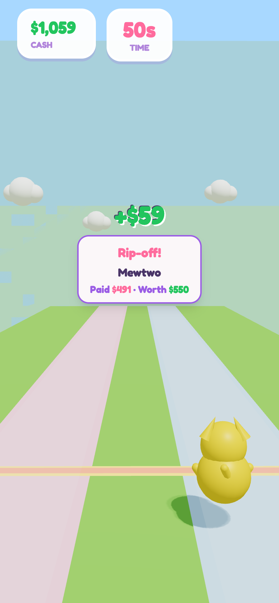

# Flip or Fold

**Renaiss Tech Hackathon S1 — Game category**

A fast-paced **lane-trading runner** for the collector economy: two real TCG cards roll toward you with shop prices — pick the lane, buy the deal, beat the clock. Built on **Renaiss graded market data**, **SilphCo Pokémon analytics**, and optional **BSC wallet checkout** for premium bonuses.

> *Train your eye for deals. Link your wallet when you want more power. Browse graded slabs in the Card Dex without leaving the game.*

---

## Screenshot



| Menu & trainer setup | Card Dex (Pokémon + market + One Piece) |
|---|---|
|  |  |

---

## Live demo (judges)

```bash
npm install
cp .env.example .env   # fill Supabase + optional API keys (see below)
npm run dev
```

Open **http://localhost:5173** — no wallet required to play the core game.

**Suggested judge path (≈3 min):**

1. Enter a trainer name → **Create & Play** → play one 60s run (←/→ or A/D).
2. Open **Card Dex** → search `Charizard` (Pokémon tab) → open a card → optional **Search Renaiss graded**.
3. Open **Shop** → spend run coins on upgrades; scroll to **Premium — wallet only** (optional, testnet BNB).
4. Check **Rank** leaderboard after game over.

---

## Hackathon fit

| Criterion | How Flip or Fold addresses it |
|-----------|-------------------------------|
| **Usability** | Playable in-browser in under 10 seconds; keyboard + touch-friendly lanes; kawaii HUD explains profit/loss on every trade. |
| **Innovation** | Arcade runner meets *real* market data — shop prices are randomized vs cached/API market values; Card Dex layers Renaiss grading on SilphCo/TCGdex search. |
| **Ecosystem relevance** | Uses **Renaiss OS Index API** for graded slabs (Pokémon + One Piece), links to [index.renaissos.com](https://index.renaissos.com); optional BNB checkout on BSC. |
| **Clarity** | In-game prices are **play economy**; Card Dex shows **labeled live/cached market data** with source attribution. |
| **Safety** | No email/password; wallet optional; crypto verified on-chain server-side; API keys client-side are rate-limited public tiers only. |

**Category:** Game — interactive collector-facing experience with real market context.

---

## What we built

### Core game — Flip or Fold

- **60-second runs** — start with **$1,000** play cash; game ends at $0 or timeout.
- **Two-lane deals** — two distinct cards approach; move left/right to buy the card in that lane.
- **Profit model** — `profit = marketValue − shopPrice`. Shop price is randomly skewed (deal / rip / fair) so players practice spotting value.
- **Powerups** — slow-mo, appraisal (reveal true value), insurance, 2× profit, cash bonus (tap to collect).
- **Meta progression** — coins & XP after each run → shop (buddies, trails, upgrades, emotes).
- **475-card classic pool** — local Pokémon TCG art + SilphCo-derived prices; optional **Renaiss graded pool** from Supabase cache.

### Card Dex (collector tool)

Three tabs, all search-on-demand (nothing bulk-stored in our DB except Renaiss cache):

| Tab | Search source | On card detail |
|-----|---------------|----------------|
| **Pokémon** | [TCGdex](https://tcgdex.dev) SDK | SilphCo market (TV-WAP, PSA grades) + button to search Renaiss graded |
| **Market** | [SilphCo Analytics](https://silphcoanalytics.xyz) API v3 | Full sales analytics + Renaiss graded search |
| **One Piece** | Renaiss cache + live API | Graded slab detail from Renaiss OS Index |

### Web3 shop (optional)

- Link MetaMask via **signed message** (proves wallet ownership).
- Buy premium packs with **tBNB on BSC testnet** (configurable to mainnet).
- Server **re-reads the transaction from BSC RPC** — client cannot fake payment.

### Backend

- **Supabase** — pseudo accounts (trainer name + device id), saves, leaderboard, crypto orders.
- **Edge functions** — `web3-link-wallet`, `web3-confirm-purchase` (service role only for finalize).

---

## Data sources & API usage

| Source | Used for | Stored in our DB? | Notes |
|--------|----------|-------------------|-------|
| **Renaiss OS Index API** | Graded cards in-game pool (sync script), Card Dex live search & detail | **Yes** — ~73+ rows in `trading_cards` (prices, images, hrefs); refreshed via `npm run sync-renaiss-cards` | Free tier ~10 req/day for live browser search; sync script respects `RENAISS_MAX_CALLS_PER_DAY`. |
| **SilphCo Analytics API v3** | Card Dex search/market; classic pool expansion (prices) | **No** — client calls + build-time script only | Requires `VITE_SILPHCO_API_KEY`; Pokémon only. Playground routes exist for some endpoints without a key. |
| **TCGdex SDK** | Card Dex Pokémon search & card metadata | **No** — client-side cache (1h TTL) | Open Pokémon TCG dataset. |
| **Pokémon TCG API** / `images.pokemontcg.io` | Card art download (`materialize-pool-images.mjs`) | **No** — images saved locally under `src/assets/cards/pool/` (~475 PNGs) for WebGL (CORS-safe) | Art credited to Pokémon TCG / TCGPlayer ecosystem. |
| **Supabase** | Accounts, scores, saves, crypto orders | **Yes** — player-owned game state only | See privacy section. |

**Assumptions & limitations (important for judges):**

- **In-game `$` prices are simulated** for fun — they are inspired by market data but scaled for 60s sessions, not live trade quotes.
- **Card Dex market figures** come from third-party APIs and may lag; we show sources and do not present them as Renaiss-verified trades unless from Renaiss detail panel.
- **SilphCo** covers **Pokémon TCG only**; One Piece in Card Dex is **Renaiss-only**.
- **Renaiss live search** in the browser is button-triggered to protect API quota.

---

## Privacy & user data

| Data | Collected? | Purpose |
|------|------------|---------|
| Email / password | **No** | — |
| Trainer name | **Yes** (user-chosen) | Pseudo account + leaderboard display |
| Device ID | **Yes** (`localStorage` UUID) | Same browser = same account; sent to Supabase RPCs |
| Game saves, coins, XP, shop | **Yes** | `player_saves` in Supabase |
| Wallet address | **Only if user links** | Crypto shop; verified by signature |
| IP / analytics | **Not implemented** | No third-party tracker in this repo |

- Leaderboard stores **final balance & run stats** — no replays or card-level PII.
- **No private Renaiss user data** is ingested; we only call public/index API endpoints with our keys.
- **Secrets** (`SUPABASE_SERVICE_ROLE_KEY`, API secrets) belong in server/Edge env only — never in the client bundle.
- Users can **unlink wallet** without deleting their trainer profile.

---

## Web3 safety (can users fake a payment?)

**No** — bonuses are granted only after server-side verification:

1. `crypto_prepare_order` creates a pending order (exact wei, treasury, 15‑min expiry).
2. User sends BNB from their **linked** wallet.
3. Edge function `web3-confirm-purchase` fetches `tx` + `receipt` from **BSC RPC** and checks:
   - transaction succeeded (`status === 1`)
   - `from` = linked wallet
   - `to` = treasury
   - `value` = order amount
   - `tx_hash` not reused
4. `finalize_crypto_order` (service role only) applies the bonus to `player_saves`.

Sending BNB to the treasury **without** a matching order does not unlock bonuses.

---

## Tech stack

- **Frontend:** React 19, Vite, TypeScript, Tailwind v4, Zustand, TanStack Query
- **3D:** React Three Fiber, Three.js, drei
- **Backend:** Supabase (Postgres + RPC + Edge Functions)
- **Web3:** ethers v6, Web3Modal, BSC testnet/mainnet (env switch)

---

## Environment variables

Copy `.env.example` → `.env`:

| Variable | Required | Purpose |
|----------|----------|---------|
| `VITE_SUPABASE_URL` | **Yes** (online features) | Leaderboard, saves, crypto |
| `VITE_SUPABASE_ANON_KEY` | **Yes** | Public Supabase client |
| `VITE_WALLETCONNECT_PROJECT_ID` | For wallet UI | WalletConnect |
| `VITE_BSC_NETWORK` | For crypto | `testnet` (default) or `mainnet` |
| `VITE_CRYPTO_TREASURY_ADDRESS` | For crypto | Receives payments |
| `VITE_SILPHCO_API_KEY` | Card Dex Market tab | SilphCo authenticated tier |
| `VITE_RENAISS_API_KEY` / `SECRET` | Optional | Higher Renaiss quota in browser |

**Edge function secrets** (Supabase dashboard): `BSC_NETWORK`, `BSC_TESTNET_RPC`, `BSC_MAINNET_RPC`, `SUPABASE_SERVICE_ROLE_KEY`.

---

## Database setup

Apply Supabase migrations in order (`supabase/migrations/`):

- `003_players.sql` — trainer accounts & scores  
- `009_player_saves.sql` — progression & shop state  
- `012_web3_crypto_shop.sql` — wallet link & crypto catalog  
- `018_trading_cards.sql` — Renaiss card cache for game pool  
- `021_trim_cards_and_search_rpc.sql` — Card Dex search RPC  
- `022_search_cards_by_game.sql` — game filter for One Piece  

Then seed Renaiss cards (optional):

```bash
npm run sync-renaiss-cards   # fetch from Renaiss API → scripts/data/renaiss-cards.json
npm run seed-renaiss-cards   # upsert into Supabase
```

---

## Card pool scripts

```bash
npm run fetch-cards              # legacy: curated ~76 cards from Pokémon TCG API
npm run expand-silphco-pool      # add popular cards via SilphCo SQL (prices)
npm run materialize-pool-images  # download art to pool/ (required for WebGL)
npm run enrich-prices            # backfill TCGPlayer prices in cards.json
```

Classic pool manifest: `src/assets/cards/cards.json` (475 cards after expansion).

---

## Project structure

```
src/
  components/     Menu, HUD, Shop, Card Dex, Crypto panel, Leaderboard
  game/           R3F scene (cards, player, environment)
  systems/        Trading, waves, powerups, card loader, sound
  services/       TCGdex, SilphCo, Renaiss browser clients
  store/          Zustand (game, shop, auth, wallet UI)
  supabase/       Client, RPC wrappers, crypto wallet flow
  assets/cards/   cards.json + pool/*.png
supabase/
  migrations/     Schema & RPCs
  functions/      web3-link-wallet, web3-confirm-purchase
scripts/          Renaiss sync, SilphCo pool expand, image materialize
docs/images/    README screenshots
```

---

## Scripts for judges

```bash
npm run dev              # local play
npm run build            # production build
npm run record-journey   # Playwright video of full user journey (optional)
node scripts/user-journey-screenshots.mjs   # capture screenshot set
```

---

## Team & links

- **Hackathon:** [Renaiss Tech Hackathon S1 — AI, Game & Tool Sprint](https://medium.com/@renaissprotocol) (Game category)
- **Renaiss:** [Website](https://renaissos.com) · [Index](https://index.renaissos.com) · [X @RenaissProtocol](https://x.com/RenaissProtocol) · [Lab @tastedotmd](https://x.com/tastedotmd)

---

## License & attribution

- Pokémon TCG card images © The Pokémon Company / Nintendo / Creatures / GAME FREAK — used via public TCG APIs for educational hackathon demo.
- Market data from SilphCo Analytics and Renaiss OS Index — not financial advice; demo only.
- Not affiliated with Nintendo, The Pokémon Company, or TCGPlayer.

**Flip or Fold** — *Taste becomes real when builders ship.*
