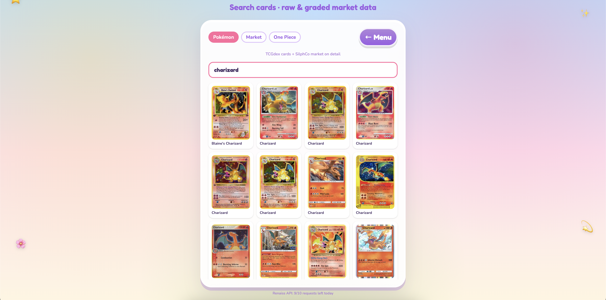
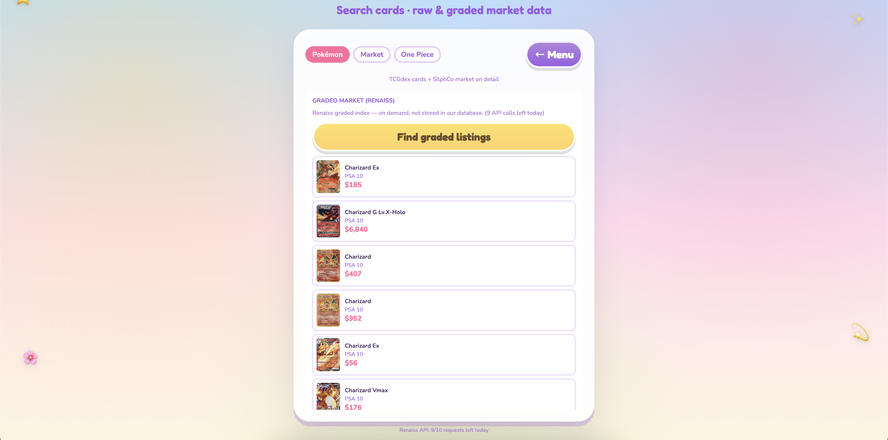
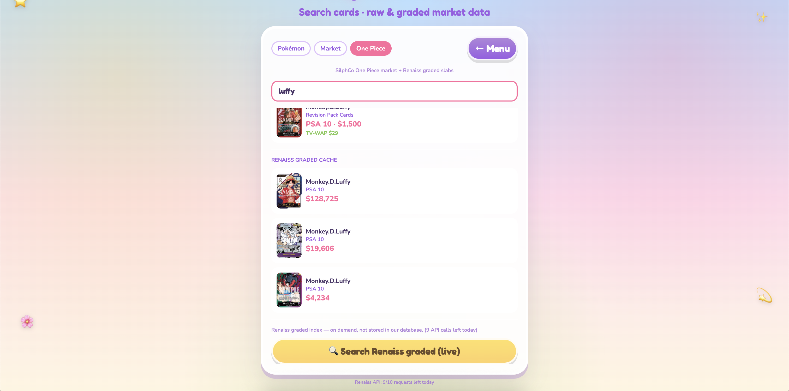

# Flip or Fold

**Renaiss Tech Hackathon S1 — Game category · Solo submission**

A 60-second **lane-trading runner** on **Renaiss Protocol**: flip graded slabs priced from the **Renaiss OS Index API**, or raw Pokémon / One Piece singles from SilphCo. Spot the deal before time runs out. Optional BSC wallet checkout for premium bonuses.

**▶ Play now:** [https://flip-or-fold.vercel.app](https://flip-or-fold.vercel.app/)

> **Judges — 3 min path:** Menu → card pool **Renaiss** → **Create & Play**. **Controls:** swipe left/right on **mobile**; on **desktop** use ←/→ or the two keys beside spacebar — **A/D** (QWERTY) or **Q/D** (AZERTY), same physical keys. Every card uses **real Index prices** (`api.renaissos.com`). Profit = reference value − shop offer (shop is randomized). Then **Card Dex** → search `Luffy` or `Charizard` → **Search Renaiss graded** for a live API call.

---

## Screenshots


| Menu                          | Card Dex                                   |
| ------------------------------- | -------------------------------------------- |
|  |  |


| Pokémon + Renaiss graded                            | Renaiss live search                                  |
| ------------------------------------------------------ | ------------------------------------------------------ |
|  |  |  |

---

## Hackathon fit


| Criterion               | How Flip or Fold addresses it                                                                                                                                                                   |
| ------------------------- | ------------------------------------------------------------------------------------------------------------------------------------------------------------------------------------------------- |
| **Usability**           | Playable in-browser in under 10 seconds; swipe on mobile, keyboard on desktop; HUD shows profit/loss on every trade.                                                                                          |
| **Innovation**          | Arcade runner + real market data (Renaiss Index + SilphCo + TCGdex); Card Dex layers graded search on top.                                                                                      |
| **Ecosystem relevance** | Official**Renaiss OS Index API** powers the in-game graded pool, Card Dex live search, and links to [index.renaissos.com](https://index.renaissos.com). Optional BNB checkout on BSC (testnet). |
| **Clarity**             | Three labeled price layers: Renaiss graded, SilphCo/TCGdex raw market, randomized shop display.                                                                                                 |
| **Safety**              | No email/password; wallet optional; crypto verified on-chain server-side.                                                                                                                       |

**Category:** Game — playable on-ramp to the Renaiss collector economy, not a mockup.

---

## Renaiss integration & pricing (read this first)

Built on the **Renaiss OS Index API** — same data as [index.renaissos.com](https://index.renaissos.com).

### Card pools (menu toggle)


| Mode        | Count                             | `marketPrice` source                    | Best for                          |
| ------------- | ----------------------------------- | ----------------------------------------- | ----------------------------------- |
| **Renaiss** | ~73 graded slabs                  | **Renaiss Index API** → Supabase cache | **Demo Renaiss integration**      |
| **Classic** | 554 (475 Pokémon + 79 One Piece) | SilphCo TV-WAP / median                 | Raw singles gameplay              |
| **Both**    | ~627 mixed                        | Renaiss + SilphCo (random draw)         | Variety — default on first visit |

### How Renaiss is called


| Touchpoint          | How                                                                                                                 |
| --------------------- | --------------------------------------------------------------------------------------------------------------------- |
| In-game graded pool | `sync-renaiss-cards.mjs` → Supabase `trading_cards` (name, grade, image, USD price)                                |
| Gameplay            | `get_trading_card_pool()` — **`profit = marketPrice − shopPrice`**; on Renaiss cards, `marketPrice` is Index data |
| Card Dex live       | `renaissBrowser.ts` → `api.renaissos.com` (button-triggered, rate-limit aware)                                     |
| Card Dex cache      | Supabase RPC`search_trading_cards`                                                                                  |

Auth: `VITE_RENAISS_API_KEY` / `VITE_RENAISS_API_SECRET` (optional — raises browser quota above ~10 calls/day).

### What is real vs gameplay-only


| Data                             | Source                                                                  |
| ---------------------------------- | ------------------------------------------------------------------------- |
| Graded slab price, grade, image  | **Renaiss Index API**                                                   |
| Raw Pokémon / One Piece singles | **SilphCo** (proxied via `/api/silphco` — SilphCo blocks browser CORS) |
| Pokémon card metadata           | **TCGdex** SDK                                                          |
| Shop lane price                  | Random skew (deal / rip / fair) —**does not replace** `marketPrice`    |

**Example:** PSA 10 Luffy at **$128k** in-game = Renaiss Index data. The shop may list it above or below — spot the deal.

Not financial advice. Hackathon demo only.

---

## Features

- **60s runs** — $1,000 play cash; ends at $0 or timeout.
- **Two-lane deals** — swipe left/right on mobile; on desktop ←/→ or side keys (A/D QWERTY · Q/D AZERTY).
- **Powerups** — slow-mo, appraisal, insurance, 2× profit, cash bonus.
- **Meta** — coins & XP → shop (buddies, trails, upgrades, emotes).

### Card Dex


| Tab           | Search                                         | Detail                                 |
| --------------- | ------------------------------------------------ | ---------------------------------------- |
| **Pokémon**  | [TCGdex](https://tcgdex.dev)                   | SilphCo market + Renaiss graded button |
| **Market**    | [SilphCo](https://silphcoanalytics.xyz) API v3 | Sales analytics + Renaiss graded       |
| **One Piece** | SilphCo`?game=onepiece` + Renaiss cache        | TV-WAP / volume + Renaiss graded       |

### Web3 shop (optional)

MetaMask link via signed message · tBNB on BSC testnet · server re-reads tx from RPC (client cannot fake payment).

---

## Author

**degenanddev** ([@degenanddev](https://github.com/degenanddev)) — solo build

- **Repo:** [github.com/degenanddev/flipOrFold](https://github.com/degenanddev/flipOrFold)
- **Live:** [flip-or-fold.vercel.app](https://flip-or-fold.vercel.app/)

---

## Links

- **Hackathon:** [Renaiss Tech Hackathon S1](https://medium.com/@renaissxyz/renaiss-tech-hackathon-s1-is-open-build-ai-games-tools-for-the-collector-economy-0ab1b39c23c4)
- **Renaiss:** [renaiss.xyz](https://renaiss.xyz) · [Index](https://index.renaissos.com) · [@RenaissProtocol](https://x.com/RenaissProtocol)
- **SilphCo:** [silphcoanalytics.xyz](https://silphcoanalytics.xyz) · [API docs](https://silphcoanalytics.xyz/docs/api/getting-started)

---

## License & attribution

Pokémon TCG images © The Pokémon Company / Nintendo / Creatures / GAME FREAK. One Piece art via TCGPlayer CDN. Market data from SilphCo Analytics and Renaiss OS Index. Not affiliated with Nintendo, TCGPlayer, or Bandai. Demo only — not financial advice.

---

<details>
<summary><strong>Developer setup</strong> (local run, env, DB, scripts)</summary>

### Local run

```bash
npm install
cp .env.example .env
npm run dev   # http://localhost:5173 — SilphCo proxied at /api/silphco
```

### Environment variables


| Variable                                            | Where                   | Purpose                                      |
| ----------------------------------------------------- | ------------------------- | ---------------------------------------------- |
| `VITE_SUPABASE_URL` / `ANON_KEY`                    | Client                  | Saves, leaderboard, Renaiss cache RPCs       |
| `VITE_SILPHCO_API_KEY`                              | Local dev               | SilphCo via Vite proxy                       |
| `SILPHCO_API_KEY`                                   | **Vercel** (no `VITE_`) | SilphCo proxy in production (`api/silphco/`) |
| `VITE_RENAISS_API_KEY` / `SECRET`                   | Client                  | Optional — higher Renaiss browser quota     |
| `VITE_WALLETCONNECT_PROJECT_ID`                     | Client                  | Wallet UI                                    |
| `VITE_BSC_NETWORK` / `VITE_CRYPTO_TREASURY_ADDRESS` | Client + Edge           | Crypto shop                                  |

**Supabase Edge secrets:** `BSC_NETWORK`, `BSC_TESTNET_RPC`, `BSC_MAINNET_RPC`, `SUPABASE_SERVICE_ROLE_KEY`.

### Database

Apply migrations in `supabase/migrations/` (through `022_search_cards_by_game.sql`), then:

```bash
npm run sync-renaiss-cards
npm run seed-renaiss-cards
```

### Card pool scripts

```bash
npm run expand-silphco-pool       # Pokémon via SilphCo
npm run expand-onepiece-pool      # One Piece singles
npm run materialize-pool-images   # Local PNGs for WebGL
npm run sync-renaiss-cards        # Renaiss → scripts/data/renaiss-cards.json
npm run seed-renaiss-cards        # Upsert into Supabase
```

### Tech stack

React 19 · Vite · TypeScript · Tailwind v4 · Zustand · TanStack Query · React Three Fiber · Supabase · ethers v6 · Web3Modal

### Privacy

Trainer name + device UUID in `localStorage`; game saves in Supabase. No email/password. No analytics tracker. Wallet address only if linked.

### Web3 safety

Bonuses granted only after `web3-confirm-purchase` verifies on BSC: tx success, correct `from`/`to`/`value`, hash not reused. `finalize_crypto_order` is service-role only.

</details>
